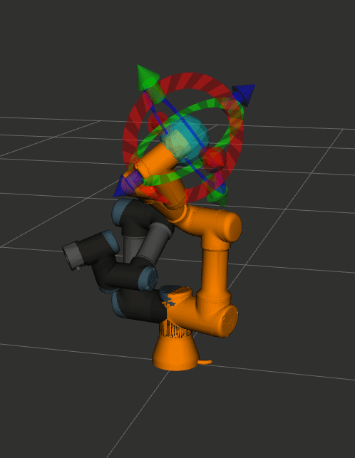

# Stanowisko z Robotem Universal Robots (UR3 CB)
W ramach serii 3 zajęć laboratoryjnych przewidzianio:
- niniejszą instrukcję, pomagającą w konfiguracji całego stanowiska (~1 zajęcia)
- mini-projekt łączący wizję (kamery RGB/głębi) z rozwiązaniem problemu _Pick & Place_ (dosł. podniesienia i położenia).

---
## Informacje dla prowadzącego
**Instrukcja ma nacisk na praktykę** pracy z robotem. Przed rozpoczęciem zajęć **należy** zapoznać grupę z niniejszymi koncepcjami:
- Roboty przemysłowe vs koboty - różnice,
- Bezpieczeństwo wokół robota (Safety) - duże czerwone przyciski,

**W trakcie budowy paczki MoveIt (około 20 min)**, należy wprowadzić grupę labolatoryjną do obsługi roboty, w szczególnośći:
- Przeprowadzić demonstrację uruchomienia robota,
- "Przeklilkanie" interfejsu (program robota, konfiguracja instalacji, poruszanie robotem, wysterowanie IO, logi),

Dodatkowo, **można** poruszyć następujące kwestie:
- Zdalne sterowanie przegubami robota (protokół spełnaijący wymogi czasu rzeczywistego (RTDE)),
- Zdalne zarządzanie stanem robota (uruchomienie i wybór programu) (Dashboard),
- Regulatory (wspomnieć o ROS 2 Control),
- Planery trajektorii.

---
# Krok 0 - Wstępna konfiguracja linuxa
**UWAGA:** Podchodząc do stanowiska, prawdopodobnie krok ten został już wykonany podczas jego pierwszego uruchomienia. **Proszę skontaktować się z prowadzącym, czy krok ten jest niezbędny.**


- Pobierz i zainstaluj swoje ulubione narzędzia, np:
```bash
sudo apt update && sudo apt install -y \
	curl \
	fzf \
	git \
	gpg \
	htop \
	mc \
	meshlab \
	mupdf \
	neovim \
	ranger \
	tmux \
	wget
```

- Visual Studio Code [docs](https://code.visualstudio.com/docs/setup/linux)
```bash
sudo apt install -y wget gpg apt-transport-https
wget -qO- https://packages.microsoft.com/keys/microsoft.asc | gpg --dearmor > packages.microsoft.gpg
sudo install -D -o root -g root -m 644 packages.microsoft.gpg /etc/apt/keyrings/packages.microsoft.gpg
sudo sh -c 'echo "deb [arch=amd64,arm64,armhf signed-by=/etc/apt/keyrings/packages.microsoft.gpg] https://packages.microsoft.com/repos/code stable main" > /etc/apt/sources.list.d/vscode.list'
rm -f packages.microsoft.gpg
sudo apt update
sudo apt install code
```

---
## Instalacja ROS 2 Humble
- Zainstaluj ROS 2 Humble [docs](https://docs.ros.org/en/humble/Installation/Ubuntu-Install-Debians.html)

1. Upewnij się, że lokalizacja systemu jest prawidłowo ustawiona:
  ```bash
locale  # check for UTF-8

sudo apt update && sudo apt install locales
sudo locale-gen en_US en_US.UTF-8
sudo update-locale LC_ALL=en_US.UTF-8 LANG=en_US.UTF-8
export LANG=en_US.UTF-8

locale  # verify settings
``` 
2. Dodaj repozytorium PPA do systemu:
  ```bash
sudo apt install -y software-properties-common curl
sudo add-apt-repository universe
sudo curl -sSL https://raw.githubusercontent.com/ros/rosdistro/master/ros.key -o /usr/share/keyrings/ros-archive-keyring.gpg
echo "deb [arch=$(dpkg --print-architecture) signed-by=/usr/share/keyrings/ros-archive-keyring.gpg] http://packages.ros.org/ros2/ubuntu $(. /etc/os-release && echo $UBUNTU_CODENAME) main" | sudo tee /etc/apt/sources.list.d/ros2.list > /dev/null
```
3. Zainstaluj paczki ROS 2:
```bash
sudo apt update
sudo apt install -y ros-humble-desktop
```

4. Pamiętaj, aby za każdym razem w terminalu użyć komendy `source` z odpowiednim workspace'em, np. `source /opt/ros/humble/setup.bash` 


---
## Instalacja narzędzi do budowy projektów

Proces instalacji narzędzi należy zacząc od `rosdep` - służy do automatycznego instalowania brakujących zalezności sklonowanych repozytoriów (paczek ROS)
```bash
sudo apt install -y python3-rosdep
sudo rosdep init
rosdep update
sudo apt update
sudo apt dist-upgrade -y
```

Następnie należy zainstalować narzędzie budowy paczek `colcon` z dodatkiem do `mixin` (który służy do rozwikłania dziedziczenia zależności paczek):
```bash
sudo apt install -y python3-colcon-common-extensions python3-colcon-mixin
colcon mixin add default https://raw.githubusercontent.com/colcon/colcon-mixin-repository/master/index.yaml
colcon mixin update default
```

Kolejnym narzędziem jest `vcstool`, służącym do automatycznego klonowania repozytoriów przy pomocy systemu kontroli wersji (np. git).
```bash
sudo apt install -y python3-vcstool
```

---
# Krok 1 - Instalacja MoveIt
Zważająć na fakt, że ROS 2 wciąż jest prężnie rozwijany, nie wszystkie paczki i moduły mogą działać od razu po ich instalacji z oficjalnego repozytorium PPA. Z tego powodu, na potrzeby ćwiczenia labolatoryjnego, nalezy pobrać i samodzielnie zbudować paczki odpowiedzialne za moduł MoveIt.

1. Procedurę zaczynamy od pobrania paczki `moveit2_tutorials`:
```bash
source /opt/ros/humble/setup.bash
mkdir -p ~/ros2_ws/src
cd ~/ros2_ws/src
git clone https://github.com/ros-planning/moveit2_tutorials --branch humble --depth 1
```

2. Nastepnie kolonujemy brakujące paczki przy pomocy narzędzia `vcstool`:
```bash
vcs import < moveit2_tutorials/moveit2_tutorials.repos
```

3. Zainstalować brakuje zależności (wszystkich paczek) przy pomocy `rosdep`:
```bash
sudo apt update && rosdep install -r --from-paths . --ignore-src --rosdistro $ROS_DISTRO -y
```

4. Kolejnym krokiem jest budowa paczek *MoveIt* i wczytania ich do aktualnego obszaru roboczego:
```bash
cd ~/ros2_ws
colcon build --mixin release
```
- **Uwaga** budowanie może trwać ponad **20 min**. Proszę wykorzystać ten czas na zapoznanie się z informacjami, które w danym momencie podaje narzędzie `colcon`. W osobnym terminalu można uruchomić program `htop` i zaobserwować użycie pamięći RAM oraz rdzeni procesora podczas kompilacji.

5. Po zakończeniu budowy, nalezy paczki wczytać do aktualnego kontekstu roboczego:
```bash
source /opt/ros/humble/setup.bash
source install/local_setup.bash
```
LUB
```bash
source install/setup.bash
```

6. (**Opcjonalne**) Można przetestować działanie MoveIt z przykładowym ramieniem robotycznym *Franka*. W tym celu należy:
- naprawić plik `~/ros2_ws/src/moveit2_tutorials/doc/tutorials/quickstart_in_rviz/launch/demo.launch.py`, poprzez dodanie linijki `rviz_node_tutorial,` w sekcji `nodes_to_start = [`.
- przebudowanie projektu komendami w punkcie 4.
- uruchomienie tutoriala:
```bash
ros2 launch moveit2_tutorials demo.launch.py rviz_tutorial:=true
```
- informacje o sterowaniu (w języku angielskim) znajdują się [w oficjalnej dokumentacji MoveIt 2](https://moveit.picknik.ai/humble/doc/tutorials/quickstart_in_rviz/quickstart_in_rviz_tutorial.html)

---

# Krok 2 Instalacja UR Robot Driver
**UWAGA: Poniższe polecania zakładają, że zarówno komputer i robot zostały już uruchomione**.

Podobnie jak podczas instalacji MoveIt, należy sklonować repozytorium, pobrać brakujące zależności i zbudować paczkę sterownika robota UR.
```bash
git clone --branch humble https://github.com/UniversalRobots/Universal_Robots_ROS2_Driver.git
cd ~/ros2_ws
vcs import src --skip-existing --input src/Universal_Robots_ROS2_Driver/Universal_Robots_ROS2_Driver-not-released.${ROS_DISTRO}.repos
rosdep update
rosdep install --ignore-src --from-paths src -y
colcon build --cmake-args -DCMAKE_BUILD_TYPE=Release
source install/local_setup.bash
```

---
## Konfiguracja sieci
Na stanowisku nr 1, komputer PC i robot UR powinny mieć następujące adresy IP:
- **PC**: `192.168.0.15`
- **UR3 CB**: `192.168.0.10`

W celu ich weryfikacji:
- **Na PC (Ubuntu)**, otworzyć terminal i uruchomić komendę `ip addr show`.
- **Na robocie (UR3 CB)**, w głównym menu PolyScope wybrać `Setup Robot`->`Network`, upewnić się, że zaznaczono opcję *DHCP*, a uzyskany adres zgadza się z w.w.

W pliku `/etc/hosts` można skonfigurować alias adresu IP (**wymagane są uprawnienia administratora**). Domyślnie, alias skonfigurowano jako `ur-robot`:
```bash
cat /etc/hosts
```

```
127.0.0.1		localhost
...
# ROBOLAB
192.168.0.10	ur-robot
...
```

---
## Instalacja URCap
W celu wykorzystania możliwości robota UR3 CB do zdalnego sterowania, należy wgrać do jego systemu rozszerzenie (tzw. *URCap*) o nazwie "*externalcontrol-1.0.5.urcap*".

Na potrzeby labolatorium **krok ten został już wykonany**. Szczegołowa instrukcja jak powtórzyć tą operację znajduje się w [oficjalnej dokumentacji ur_robot_driver](https://docs.ros.org/en/ros2_packages/rolling/api/ur_robot_driver/installation/install_urcap_cb3.html).

---
## Konfiguracja programu robota
Program na robocie składa się zarówno z kolejnych poleceń (kolokwialnie: "kodu") oraz konfiguracji stanowiska, w którego skład wchodzą między innymi: definicje płaszczyzn ograniczających przestrzeń roboczą i konfiguracja zewnętrznych peryferii (np. chwytaka).

Konfiguracja programu "od zera" jest czasochłonną operacją, którą należy wykonać na początku instalacji robota na danym stanowisku. Najczęściej wykonują to osoby techniczne, odpowiedzialne m.in. za postument dla robota, klatkę bezpieczeńśtwa i ułożenie połączeń elektrycznych.

Techniczne mówiąć, część "kodu" po stronie robota sprowadza się do wywołania polecenia "*External Control*".W celu jego wywołania, Proszę spróbować przejść przez poniższą "ścieżkę A)":

### A) Kolejne uruchomienie robota
- Sprawdzić czy suma kontrolna (hash) konfiguracji bezpieczeństwa w **prawym górnym rogu** teach petanda jest równa: `7EE6`.
  - W przypadku rozbieżnośći, należy wykonać kroki w sekcji poniżej (tj. "B) Pierwsze uruchomienie robota w laboratorium")
- Utworzyć nowy program (`Program Robot->Empty Program`)
- Po **lewej** stronie okna wybrać *Robot Program*
- Z zakładki `Strcutre` wybrać zakładkę `URCaps`
- Dodać komendę `External Control`

### B) Pierwsze uruchomienie robota w laboratorium
Niniejsze kroki mają zapewnić **poprawną konfigurację płaszczyzn bezpieczeństwa (safety) robota**.

Mająć powyższe na uwadze, **dla potrzeb laboratorium zostanie wykorzystany wcześniej skonfigurowany program po stronie robota**:
- W głównym ekranie PolyScope wybrać **Program Robot**,
- Następnie **Load Program**,
- Wybrać plik *robolab_c3_13.urp*,
- Sprawdzić czy suma kontrolna (hash) konfiguracji bezpieczeństwa w **prawym górnym rogu** teach petanda jest równa: `7EE6`.
  - W przypadku rozbieżnośći, należy skonsultować się z prowadzącym.


Po wykonaniu powyższych kroków, robot jest gotowy do zdalnego sterowania z poziomu komputera .

# Krok 3 - Uruchomienie MoveIt 2 + UR Robot Driver

### Kalibracja kinematyki robota
Na końcu linii produkcyjnej, każdy robot jest indywidualnie kalibrowany. Parametry kalibracji są niezbędne do przeprowadzania precyzyjnych obliczeń kinematyki prostej i odwrotnej. Plik ten jest zaszyty w kontrolerze robota. W celu obliczania prawidłowych nastaw przegubów z poziomu komputera, należy ten plik wyekstraktować. 

Aby nie zagłebiać się w dokumentację robota (i ręcznie implemnetować zapytania API do uzyskania tych danych), można wykorzystać gotowy skrypt paczki `ur_robot_driver`:
```bash
ros2 launch ur_calibration calibration_correction.launch.py robot_ip:=ur-robot target_filename:="${HOME}/my_robot_calibration.yaml"
```
gdzie, argumenty:
- `robot_ip` - (string) jest adresem IP (lub aliasem) robota,
- `target_filename` - (string) jest ścieżką, pod którą ma zostać zapisany plik YAML z kalibracją robota.

---

## Pliki launch
Poniższa sekcja powstała na podstawie [dokumententacji ur_robot_driver](https://docs.ros.org/en/ros2_packages/rolling/api/ur_robot_driver/usage.html). Poniższe kroki zakładają tylko i wyłącznie użycie *prawdziwego* robota, jednakże trzeba zaznaczyć, że istnieje możliwość uruchomienia robota w symulacji.

W paczce *ur_robot_driver* znajdują się dwa pliki launch:
- `ur_control.launch.py` - który uruchamia pełną kontrolę nad robotem (kontroler, monitory stanu, sterownik przegubów, oraz dashboard do zarządzania uruchomionym programem),
- `ur_dashboard_client.launch.py` - uruchamia tylko dashboarda.

Powyższe pliki mogą przyjąć rózne argumenty uruchomieniowe. Ich wytłumaczenie i spis znajduje się w [dokumentacji ur_robot_driver](https://docs.ros.org/en/ros2_packages/rolling/api/ur_robot_driver/usage.html#launch-files).

## Własny plik launch
Na podstawie [dokumentacji ur_calibration](https://github.com/UniversalRobots/Universal_Robots_ROS2_Driver/blob/082dd2a90e0b2ac8b69d69bacf662806a7a572b9/ur_calibration/README.md).

Aby wykorzystać kalibrację, należy utworzyć własną paczkę z własnym plikiem launch. Należy zacząć od utworzenia własnej, nowej paczki. **UWAGA! Proszę skonfigurować własną NAZWĘ PACZKI!** 

```bash
export PACKAGE_NAME=NAZWA_GRUPY_ur_launch
cd ~/ros2_ws/src
ros2 pkg create $PACKAGE_NAME --build-type ament_cmake  --dependencies ur_client_library \ --description "Package containing calibrations and launch files for RoboLab's UR robot."
```

Nastepnie tworzymy szkielet folderów paczki.
```bash
mkdir -p $PACKAGE_NAME/config/ur3
mkdir -p $PACKAGE_NAME/launch
echo 'install(DIRECTORY etc launch DESTINATION share/${PROJECT_NAME})' >> $PACKAGE_NAME/CMakeLists.txt
```

Do folderu `config/ur3` należy przekopiować wcześniej wyekstraktowaną kalibrację robota:

```bash
cp ~/my_robot_calibration.yaml ~/ros2_ws/src/$PACKAGE_NAME/config/ur3/ur3_calibration.yaml
```

Następnie, należy skopiować bazowy plik launch dla robota UR3 CB do nowej paczki:
```bash
cp $(ros2 pkg prefix ur_bringup)/share/ur_bringup/launch/ur_control.launch.py ur3.launch.py
```

Skopiowany plik (tj. `launch/ur3.launch.py`) należy wyedytować. Zostaną do niego wprowadzone nastepujące zmiany:
- wskazanie plik konfiguracji robota w paczce. **UWAGA! Proszę pamiętać o WŁASNEJ nazwie paczki!**
	```python
	# ...
	kinematics_params = PathJoinSubstitution(
			[FindPackageShare("NAZWA_PACZKI"), "config", ur_type, "ur3_calibration.yaml"]
		)
	# ...
	```
- domyślny argument modelu robota ustawić na `ur3`,
	```python
	# ...
	declared_arguments.append(
            DeclareLaunchArgument(
                "ur_type",
                description="Type/series of used UR robot.",
                choices=["ur3", "ur3e", "ur5", "ur5e", "ur10", "ur10e", "ur16e"],
                default_value="ur3",
            )
        )
	# ...
	```
- domyślmny argument adresu IP ustawić na `ur-robot`,
	```python
	# ...
	declared_arguments.append(
            DeclareLaunchArgument(
                "robot_ip", 
                description="IP address by which the robot can be reached.",
                default_value="ur-robot",
            )
        )
	# ...
	```
- wyłączyć domyślne uruchomienie RViza,
	```python
	# ...
	declared_arguments.append(
           DeclareLaunchArgument("launch_rviz", default_value="false", description="Launch RViz?")
        )
	# ...
	```

Następnie, należy paczkę zbudować i wczytać:
```bash
colcon build --packages-select $PACKAGE_NAME
source ./install/local_setup.bash
```

---
# Krok 4 - Dodatkowe peryferia
**Ta sekcja NIE jest wymagana do rozpoczęcia ruszania robotem**.

## Dodanie modelu chwytu kamery + chwytaka do modelu robota
Luźno inspirowane [tutorialem Compas Fab](https://gramaziokohler.github.io/compas_fab/0.21.0/examples/03_backends_ros/07_ros_create_urdf_ur5_with_measurement_tool.html#3-7-3-create-xacros-and-generate-urdf).

Kolejnym krokiem jest rozszerzenie modelu robota o zamontowane narzędzie (tu: chwytak i kamerę). W tym celu należy:
- zdobyć model CAD elementów (np. w formacie `*.stl`),
- rozszerzyć definicję modelu robota o dodatkowe połaczenia (i ich parametry fizyczne).

Niektóre parametry (np. macierz momentów bezwładności) mogą zostać założone (przy pewnych założenich, m.in. jednorodnego materiału) przy pomocy programu *MeshLab* - więcej informacji znajduje się w [dokumentacji Gazebo](https://classic.gazebosim.org/tutorials?tut=inertia#Computingtheinertialparameters).

Opis kinematyki robota (zarówno geometrii jak i połączeń pomiędzy jego przegubami) jest typowo definiowany w języku XML w formacie **URDF** (and. *Unified Robotics Description Format*. [dokumentacja](https://docs.ros.org/en/foxy/Tutorials/Intermediate/URDF/URDF-Main.html)). Masowa edycha plików XML dla floty robotów może okazać się dość czasochłonna. Dla potrzeby parametryzacji plików XML w ROSie został opracowany język makr **Xarco** (*XML Macros*). Xarco pozwala na pisanie krótszych (a tym samym czytelniejszych) plików XML. Więcej na temat Xarco można przeczytać w [dokumentacji ROS 2](https://docs.ros.org/en/foxy/Tutorials/Intermediate/URDF/Using-Xacro-to-Clean-Up-a-URDF-File.html).

Bazowy model robota UR3 CB można pobrać ze strony producenta, a następnie samodzielnie przekuć go w plik URDF.Jednakże, wygodniejszą metodą będzie skorzystanie z gotowego opisu w paczce [Universal_Robots_ROS2_Description](https://github.com/UniversalRobots/Universal_Robots_ROS2_Description) (katalog `urdf`).

Wyżej wymieiona definicja kinematyki robota UR3 CB w pcacze *Universal_Robots_ROS2_Description* została zdefiniowana przy pomocy makra Xarco w pliku `urdf/ur_macro.xacro`.


1. Dostarczyć plik `stl` oraz `dae`.

W paczce utworzyć katalog `meshes` z podkatalogami `collision` i `visual`, przekopiwująć do nich kolejno pliki `.stl` oraz `.dae`. Finalnie, struktura plików ma wyglądać następująco:
```
NAZWA_PACZKI
- etc
- launch
- meshes
	- collision
		- gripper_camera.stl
	- visual
		- gripper_camera.stl
...
```

1. Wedytować `urdf/ur_macro.xacro` tak, aby zawrzeć informacje o chwyatku
	- TODO: rozszerzyć o modyfikację pliku z kalibracją (ddodanie członu parametrów chwytaka)
2. Wedytować pliki:
	- `config/ur3/physical_parameters.yaml`
	- `config/ur3/visual_parameters.yaml`

3. Wyedytować plik `launch/ur3.launch.py` by uwzględnić powyższe modyfikacje, tj:
	```python
		# ...
		physical_params = PathJoinSubstitution(
			[FindPackageShare("NAZWA_PACZKI"), "config", ur_type, "physical_parameters.yaml"]
		)
		visual_params = PathJoinSubstitution(
        	[FindPackageShare("NAZWA_PACZKI"), "config", ur_type, "visual_parameters.yaml"]
    	)
		# ...
	```
	```python
	    # ...
		robot_description_content = Command(
        	[
            	PathJoinSubstitution([FindExecutable(name="xacro")]),
            	" ",
            	PathJoinSubstitution([FindPackageShare("NAZWA_PACZKI"), "urdf", description_file]),
            	" ",
				# ...
	``

## Dodanie płaszczyzn Workspace'a
Bez zdefiniownia obszaru roboczego robot może poruszać się "bez ograniczeń". O ile kontroler ruchu robota może mieć niskopoziomowo zdefiniowane protokoły bezpieczeństwa, o tyle planer trajektorii w *MoveIt* nie ma takich informacji pobieranych z automatu.



## Dodanie transformacji
Na podstawie [dokumentacji bibliotetki TF2](https://docs.ros.org/en/rolling/Tutorials/Intermediate/Tf2/Writing-A-Tf2-Static-Broadcaster-Cpp.html#the-proper-way-to-publish-static-transforms).

W pliku `launch/ur3.launch.py` należy dopisać definicję uruchomienia dodatkowych node'ów `static_transform_publisher`, które jednorazowo opublikują statyczną transformację. Do realizacji ćwiczenia potrzebnych jest kilka definicji:

### Chwytak z kamerą
```python
tool0_tool1_static_transform = Node(
        package='tf2_ros',
        executable='static_transform_publisher',
        arguments = ['--x', '0', '--y', '0', '--z', '0.075', '--yaw', '0', '--pitch', '0', '--roll', '0', '--frame-id', 'tool0', '--child-frame-id', 'tool1']
    )
```

### Kamera głębi całej sceny
```python
base_to_depth_camera_static_transform = Node(
        package='tf2_ros',
        executable='static_transform_publisher',
        arguments = ['--x', '0', '--y', '0', '--z', '1.3', '--yaw', '0', '--pitch', '1.5707963', '--roll', '0', '--frame-id', 'base', '--child-frame-id', 'depth_camera']
    )
```

Następnie musimy dodać te node'y do uruchomienia:
```python
nodes_to_start = [
	# ...
	tool0_to_tool1_static_transform,
    base_to_depth_camera_static_transform,
    ]
```

---

# Krok 5 - Uruchomienie


## Plik launch domyślny (NIEZALECANE)
W jednym terminalu, należy uruchomić driver:
```bash
ros2 launch ur_robot_driver ur_control.launch.py ur_type:=ur3 robot_ip:=ur-robot launch_rviz:=false
```

## Plik launch z kalibracją robota (ZALACANE)
 
W jednym terminalu, należy uruchomić driver:
```bash
ros2 launch $PACKAGE_NAME ur3.launch.py
```

## Dalsze uruchamianie
Na teach petandzie, należy kliknąć przycisk **Play**, aby uruchomić program. Można osiągnąć ten sam efekt, wołająć serwis *dasboard*:

```bash
ros2 service call /dashboard_client/play std_srvs/srv/Trigger {}
```

W drugim terminalu, należy uruchomić MoveIt:
```bash
ros2 launch ur_moveit_config ur_moveit.launch.py ur_type:=ur3 launch_rviz:=true
```
---
# Krok 6 - Sterowanie chwytakiem i IO 
## Odczyt IO z robota
Typ: `ur_msgs/msg/IOStates`
```bash
ros2 topic echo /io_and_status_controller/io_states
```

## Sterowanie chwytakiem Schmalz

- Chwytak Schmalz ECBPMi 24V-DC M12-8 - [Dokumetnacja](https://www.schmalz.com/en-it/vacuum-technology-for-robotics/vacuum-generators/vacuum-generators-ecbpmi-312576/10.03.01.00556/)
- 

Na podstawie [ur_msgs/srv/SetIO.srv](https://github.com/ros-industrial/ur_msgs/blob/melodic-devel/srv/SetIO.srv):
```
# digital tool output
int8 PIN_TOOL_DOUT0 = 16
int8 PIN_TOOL_DOUT1 = 17

# Note: 'fun' is short for 'function' (ie: the function the service should perform).
int8 FUN_SET_DIGITAL_OUT = 1
int8 FUN_SET_FLAG = 2
int8 FUN_SET_ANALOG_OUT = 3
int8 FUN_SET_TOOL_VOLTAGE = 4

# valid values for 'state' when setting digital IO or flags
int8 STATE_OFF = 0
int8 STATE_ON = 1
```

Zasady  działania chwytaka pneumatycznego firmy Shmalz: 
- podanie `1` na Tool Input 1 uruchamia pompkę. `0` wyłącza pompkę.
- podanie `1` na Tool Input 0 wypuszcza powietrze. `0` zatyła zawór.


| Stan | Efekt       |
| ---- | ----------- |
| `00` | Brak chwytu |
| `10` | Upuszczenie |
| `11` | Upuszczenie |
| `01` | Chwyt       |

Chwyt
```bash
ros2 service call /io_and_status_controller/set_io ur_msgs/srv/SetIO "{fun: 1, pin: 17, state: 1}"
```

Opuszczenie
```bash
ros2 service call /io_and_status_controller/set_io ur_msgs/srv/SetIO "{fun: 1, pin: 16, state: 1}"
```


---
# Bibliografia

- ur_robot_driver [repo](https://github.com/UniversalRobots/Universal_Robots_ROS2_Driver)
- ur_robot_driver [docs](https://docs.ros.org/en/ros2_packages/rolling/api/ur_robot_driver/index.html)
- moveit 2 [docs](https://moveit.picknik.ai/humble/index.html)

---
# TODO 
- Kalibracja transformacji kamery głebi (Astra)
- Kalibracja transofrmiacji kamery głębi (RealSense)
- Opracowanie skryptu do czyszczenia stanowisk między grupami
